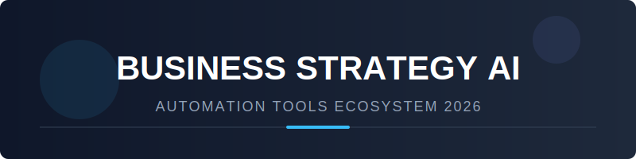

# Business Strategy AI Agent Ecosystem 🤖📈

  
   
  

    <b>The authoritative directory for AI-powered Strategy Planning, OKR Execution, and Decision Intelligence.</b>
  

  
  
  
  
  

---

## 🚀 Overview: The Future of Business Strategy Automation

This repository tracks the most impactful **SaaS platforms** and **Open-Source projects** revolutionizing **Business Strategy Automation**. As of 2026, these tools enable leadership teams to automate:

*   🎯 **Strategic Planning:** From board-level goals to team-level OKRs.
*   📊 **Scenario Modeling:** Predictive AI for market shifts and internal pivots.
*   🤖 **Agentic Execution:** Autonomous agents that monitor progress and trigger initiatives.
*   🧠 **Decision Intelligence:** Real-time data synthesis and reporting for C-suite leaders.

> **SEO Tags:** Business Strategy AI, OKR Automation, AI Strategic Planning, Enterprise AI Agents, Decision Intelligence SaaS, Open Source AI Agents 2026.

---

## 📑 Table of Contents
- [✨ SaaS Products & Enterprise Platforms](#-saas-products--enterprise-platforms)
- [🏗️ Open-Source GitHub Projects](#-open-source-github-projects)
- [🤝 How to Contribute](#-how-to-contribute)
- [⚖️ Disclaimer](#-disclaimer)

---

## ✨ SaaS Products & Enterprise Platforms

The top SaaS products in the strategy automation space, ranked by valuation and market impact.

| Product | Description | Company Size (Valuation) | Starting Price | Free Tier Limit |
| :--- | :--- | :--- | :--- | :--- |
| **[Google NotebookLM](https://notebooklm.google.com/)** | AI research and synthesis tool for strategy analysis. | **$2.03T** (Alphabet) | $0 (Standard) | Free plan (100 notebooks) |
| **[ThoughtSpot](https://thoughtspot.com/)** | AI-driven analytics and strategy platform. | **$4.2B** | $25/user/mo | 1-year free Developer |
| **[WorkBoardAI](https://workboard.com/)** | Enterprise strategy execution and OKR platform. | **$725M** | ~$20/user/mo | 14-day free trial |
| **[Gumloop](https://gumloop.com/)** | No-code AI automation for custom strategy flows. | **$250M+** | $37/mo | Free (5,000 credits/mo) |
| **[Lindy](https://www.lindy.ai/)** | Autonomous AI assistant for operations and strategy. | **~$50M** | $19.99/mo | Free (400 credits/mo) |
| **[OnePlan](https://oneplan.ai/)** | Intelligent strategy and portfolio management. | **$41.9M** | $35/mo | Free (50 objects) |
| **[Cascade Strategy](https://cascadestrategy.com/)** | Modern strategy execution platform. | **Growth Stage** | $59/mo | Free (up to 4 users) |
| **[Precision.co](https://precision.co/)** | AI-powered decision intelligence tool. | **Growth Stage** | $99/mo | 5-day free trial |
| **[CoachOS](https://coachos.ai/)** | Operating system for goal setting and performance. | **Seed Stage** | £59/mo | 14-day free trial |
| **[Foray AI](https://foray.ai/)** | AI strategy copilot for adaptive decision-making. | **Seed Stage** | Usage-based | Limited free credits |

---

## 🏗️ Open-Source GitHub Projects

The leading open-source frameworks for building sovereign strategy agents and workflows.

- **[n8n](https://github.com/n8n-io/n8n)**   
  ⚡ *Best for: Workflow Automation & LLM Pipelines*  
  Leading open-source tool for building custom AI strategy reporting and decision flows.

- **[Langflow](https://github.com/langflow-ai/langflow)**   
  🎨 *Best for: Visual Agent Development*  
  Visual environment for creating complex strategy automation flows on LangChain.

- **[OpenWebUI](https://github.com/open-webui/open-webui)**   
  🏠 *Best for: Local Strategy Assistants*  
  Local-first interface for interacting with strategy-tuned LLMs privately.

- **[Dify](https://github.com/langgenius/dify)**   
  🛠️ *Best for: Knowledge-Driven Agents*  
  Visual builder for strategy automation and RAG-based decision agents.

- **[AutoGen](https://github.com/microsoft/autogen)**   
  🤖 *Best for: Multi-Agent Conversations*  
  Microsoft framework for sophisticated multi-step strategy planning.

- **[CrewAI](https://github.com/crewAIInc/crewAI)**   
  👥 *Best for: Role-Based Agent Teams*  
  Framework to create strategy teams (Planner, Analyst, Reviewer agents).

- **[Plane](https://github.com/makeplane/plane)**   
  📅 *Best for: Open-Source Project Management*  
  Modern foundation for tracking strategic initiatives and team alignment.

- **[Twenty](https://github.com/twentyhq/twenty)**   
  🤝 *Best for: CRM & Relationship Strategy*  
  Open-source CRM serving as a foundation for strategy execution tools.

- **[Huginn](https://github.com/huginn/huginn)**   
  🕵️ *Best for: Business Signal Monitoring*  
  Monitors external signals to trigger internal strategy adjustments.

- **[PostHog](https://github.com/posthog/posthog)**   
  📈 *Best for: Product-Led Strategy*  
  Analytics and experimentation for data-driven strategic pivots.

- **[LangGraph](https://github.com/langchain-ai/langgraph)**   
  🔄 *Best for: Stateful Strategy Agents*  
  Framework for reliable, controllable, and adaptive planning systems.

- **[Budibase](https://github.com/Budibase/budibase)**   
  🖥️ *Best for: Internal Strategy Dashboards*  
  Low-code platform for building custom planning and automation interfaces.

- **[Phidata](https://github.com/phidatahq/phidata)**   
  🧠 *Best for: Knowledge-Base Agents*  
  Framework for building production AI agents with memory for business strategy.

- **[MetricFlow](https://github.com/transform/metricflow)**   
  🔢 *Best for: Semantic Strategy Metrics*  
  Ensures consistency in how strategic KPIs are calculated across teams.

---

## 🤝 How to Contribute

We love community contributions! Help us keep this list the #1 resource for **AI Strategy Automation**.

1.  🍴 **Fork** the repository.
2.  📝 **Add** your tool or project (follow the current format).
3.  🚀 **Submit** a Pull Request with a short explanation.

---

## ⚖️ Disclaimer

*This list is community-curated for informational purposes. AI strategy tools should support, not replace, human judgment in critical business decisions. Self-hosted solutions require proper governance.*

---

  <b>Built for CEOs, Operations Leaders, and AI Innovators.</b> 
  Made with ❤️ by the Strategy AI Community (2026)

